# AWS Durable Execution SDK for Python

[](https://pypi.org/project/aws-durable-execution-sdk-python)
[](https://pypi.org/project/aws-durable-execution-sdk-python)

-----

## Table of Contents

- [Installation](#installation)
- [License](#license)

## Installation

```console
pip install aws-durable-execution-sdk-python
```

## Developers
Please see [CONTRIBUTING.md](CONTRIBUTING.md). It contains the testing guide, sample commands and instructions
for how to contribute to this package.

tldr; use `hatch` and it will manage virtual envs and dependencies for you, so you don't have to do it manually.

## Core Architecture
The entry-point that consumers of the SDK interact with is the DurableContext.

### DurableContext Operations
- **Core Methods**: `set_logger`, `step`, `invoke`, `map`, `parallel`, `run_in_child_context`, `wait`, `create_callback`, `wait_for_callback`, `wait_for_condition`
- **Thread Safety**: Uses `OrderedCounter` for generating sequential step IDs
- **State Management**: Delegates to `ExecutionState` for checkpointing

### Concurrency Implementation
- **Map/Parallel**: Both inherit from `ConcurrentExecutor` abstract base class
- **Thread Pool**: Uses `ThreadPoolExecutor` for concurrent execution
- **State Tracking**: `ExecutableWithState` manages individual task lifecycle
- **Completion Logic**: `ExecutionCounters` tracks success/failure criteria
- **Suspension**: `TimerScheduler` handles timed suspensions and resumptions

### Configuration System
- **Modular Configs**: Separate config classes for each operation type
- **Completion Control**: `CompletionConfig` defines success/failure criteria
- **Serialization**: `SerDes` interface for custom serialization

### Operation Handlers
- **Separation of Concerns**: Each operation has dedicated handler function
- **Checkpointing**: All operations integrate with execution state checkpointing
- **Error Handling**: Consistent error handling and retry logic across operations


## Operation Handlers
The `DurableContext` calls operation handlers, which contain the execution logic for each operation.

```mermaid
classDiagram
    class DurableContext {
        +step(Callable func, str name, StepConfig config) T
        +invoke(str function_name, P payload, str name, InvokeConfig config) R
        +map(Sequence inputs, Callable func, str name, MapConfig config) BatchResult
        +parallel(Sequence functions, str name, ParallelConfig config) BatchResult
        +run_in_child_context(Callable func, str name, ChildConfig config) T
        +wait(int seconds, str name)
        +create_callback(str name, CallbackConfig config) Callback
        +wait_for_callback(Callable submitter, str name, WaitForCallbackConfig config) Any
        +wait_for_condition(Callable check, WaitForConditionConfig config, str name) T
    }

    class step_handler {
        <<function>>
        +step_handler(Callable func, ExecutionState state, OperationIdentifier op_id, StepConfig config, Logger logger) T
    }

    class invoke_handler {
        <<function>>
        +invoke_handler(str function_name, P payload, ExecutionState state, OperationIdentifier op_id, InvokeConfig config) R
    }

    class map_handler {
        <<function>>
        +map_handler(Sequence items, Callable func, MapConfig config, ExecutionState state, Callable run_in_child_context) BatchResult
    }

    class parallel_handler {
        <<function>>
        +parallel_handler(Sequence callables, ParallelConfig config, ExecutionState state, Callable run_in_child_context) BatchResult
    }

    class child_handler {
        <<function>>
        +child_handler(Callable func, ExecutionState state, OperationIdentifier op_id, ChildConfig config) T
    }

    class wait_handler {
        <<function>>
        +wait_handler(int seconds, ExecutionState state, OperationIdentifier op_id)
    }

    class create_callback_handler {
        <<function>>
        +create_callback_handler(ExecutionState state, OperationIdentifier op_id, CallbackConfig config) str
    }

    class wait_for_callback_handler {
        <<function>>
        +wait_for_callback_handler(DurableContext context, Callable submitter, str name, WaitForCallbackConfig config) Any
    }

    class wait_for_condition_handler {
        <<function>>
        +wait_for_condition_handler(Callable check, WaitForConditionConfig config, ExecutionState state, OperationIdentifier op_id, Logger logger) T
    }

    DurableContext --> step_handler : calls
    DurableContext --> invoke_handler : calls
    DurableContext --> map_handler : calls
    DurableContext --> parallel_handler : calls
    DurableContext --> child_handler : calls
    DurableContext --> wait_handler : calls
    DurableContext --> create_callback_handler : calls
    DurableContext --> wait_for_callback_handler : calls
    DurableContext --> wait_for_condition_handler : calls
```



## Configuration Module Classes


## Types and Protocols Module


## SerDes Module Classes


## Concurrency Architecture - Map and Parallel Operations


## Concurrency Flow


## Threading and Locking


## Checkpointing System

The SDK invokes the AWS Lambda checkpoint API to persist execution state. Checkpoints are batched for efficiency and can be either 
synchronous (blocking) or asynchronous (non-blocking). Critical checkpoints are blocking,
meaning that execution will not proceed until the checkpoint call has successfully completed.

### Checkpoint Types

Checkpoints are categorized by their action (START, SUCCEED, FAIL) and whether they are critical to execution correctness:

| Operation Type | Action | Is Sync? | Rationale |
|---------------|--------|----------|-----------|
| Step (AtMostOncePerRetry) | START | Yes | Prevents duplicate execution - must wait for confirmation |
| Step (AtLeastOncePerRetry) | START | No | Performance optimization - idempotent operations can retry |
| Step | SUCCEED/FAIL | Yes | Ensures result persisted before returning to caller |
| Callback | START | Yes | Must wait for API to generate callback ID |
| Callback | SUCCEED/FAIL | Yes | Ensures callback result persisted |
| Invoke | START | Yes | Ensures chained invoke recorded before proceeding |
| Invoke | SUCCEED/FAIL | Yes | Ensures invoke result persisted |
| Context (Child) | START | No | Fire-and-forget for performance - parent tracks completion |
| Context (Child) | SUCCEED/FAIL | Yes | Ensures child result available to parent |
| Wait | START | No | Observability only - no blocking needed |
| Wait | SUCCEED | Yes | Ensures wait completion recorded |
| Wait for Condition | START | No | Observability only - condition check is idempotent |
| Wait for Condition | SUCCEED/FAIL | Yes | Ensures condition result persisted |
| Empty Checkpoint | N/A | Yes (default) | Refreshes checkpoint token and operations list |

### Synchronous vs Asynchronous Checkpoints

**Synchronous Checkpoints (is_sync=True, default)**:
- Block the caller until the checkpoint is processed by the background thread
- Ensure the checkpoint is persisted before continuing execution
- Safe default for correctness
- Used for critical operations where confirmation is required

**Asynchronous Checkpoints (is_sync=False, opt-in)**:
- Return immediately without waiting for the checkpoint to complete
- Performance optimization for specific use cases
- Used for observability checkpoints and fire-and-forget operations
- Only safe when the operation is idempotent or non-critical

### Checkpoint Batching

The SDK uses a background thread to batch multiple checkpoint operations into a single API call for efficiency. This reduces API overhead and
improves throughput.


### Batching Configuration

Checkpoint batching is controlled by `CheckpointBatcherConfig`:

```python
@dataclass(frozen=True)
class CheckpointBatcherConfig:
    max_batch_size_bytes: int = 750 * 1024  # 750KB
    max_batch_time_seconds: float = 1.0     # 1 second
    max_batch_operations: int | float = float("inf")  # No limit
```

The background thread collects operations until one of these limits is reached:
1. Batch size exceeds 750KB
2. 1 second has elapsed since the first operation
3. Maximum operation count is reached (unlimited by default)

### Concurrency Management

The checkpointing system handles concurrent operations (map/parallel) by tracking parent-child relationships:

1. When a CONTEXT operation completes (SUCCEED/FAIL), all descendant operations are marked as orphaned
2. Orphaned operations are rejected if they attempt to checkpoint
3. This prevents child operations from checkpointing after their parent has already completed
4. Uses a single lock (`_parent_done_lock`) to coordinate completion and checkpoint validation

### Error Handling

When a checkpoint fails in the background thread:

1. **Error Signaling**: The background thread creates a `BackgroundThreadError` wrapping the original exception
2. **Event Notification**: All completion events (both in the current batch and queued operations) are signaled with this error
3. **Immediate Propagation**: Synchronous callers waiting on `create_checkpoint(is_sync=True)` immediately receive the `BackgroundThreadError` 
4. **Future Prevention**: A failure event (`_checkpointing_failed`) is set to prevent any future checkpoint attempts
5. **Clean Termination**: The background thread exits cleanly after signaling all waiting operations

For **synchronous operations** (default `is_sync=True`):
- The main thread receives `BackgroundThreadError` immediately when calling `create_checkpoint()`
- This prevents further execution with corrupted state

For **asynchronous operations** (`is_sync=False`):
- The error is detected on the next synchronous checkpoint attempt
- The `_checkpointing_failed` event causes immediate failure before queuing

This ensures no code continues executing after a checkpoint failure, maintaining execution state integrity.

## License

This project is licensed under the [Apache-2.0 License](LICENSE).
